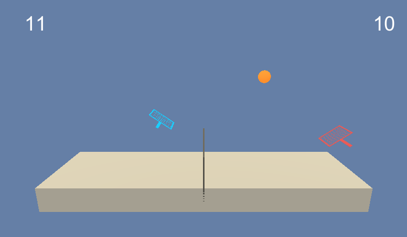

## Introduction
This project is being done as part of the [Udacity Deep Reinforcement Learning Nanodegree](https://www.udacity.com/course/deep-reinforcement-learning-nanodegree--nd893), a four month course that I am enrolled in.

We will use reinforcement learning to train an agent inside a [Unity-ML](https://github.com/Unity-Technologies/ml-agents) [Tennis](https://github.com/Unity-Technologies/ml-agents/blob/master/docs/Learning-Environment-Examples.md#tennis) environment.


## Environment Description
In this environment we are training two agents to collaboratively play tennis.  Their goal is to hit the ball back and forth over the net and not let the ball touch the ground or go out of bounds.


#### Observation Space
The observation space for each agent consists of 8 variables corresponding to the position and velocity of the ball and racket.  Observations over the last three time steps are stacked together for a total of 24 dimensions per agent.  Putting the two agents together results in a final observation vector of 48 dimensions.


#### Action Space
Two continuous actions are available for each agent, corresponding to movement toward (or away from) the net, and jumping.  Putting the two agents together results in a final action vector of 4 dimensions.  Every entry in the action vector is a number between -1 and 1.


#### Reward Structure
 If an agent hits the ball over the net, it receives a reward of +0.1. If an agent lets a ball hit the ground or hits the ball out of bounds, it receives a reward of -0.01.


#### Solve Criteria
The task is episodic, and in order to solve the environment, the agents must get an average score of +0.5 (over 100 consecutive episodes, after taking the maximum over both agents).  Specifically,
- After each episode, we add up the rewards that each agent received (without discounting), to get a score for each agent. This yields 2 (potentially different) scores. We then take the maximum of these 2 scores.
- This yields a single score for each episode.
The environment is considered solved, when the average (over 100 episodes) of those scores is at least +0.5.


## Installation

#### Step 1: Clone the repo
Clone this repo using `git clone https://github.com/danielnbarbosa/drlnd_collaboration_and_competition.git`.  Pre-compiled Unity environments for MacOS and Linux are included in this repo.


#### Step 2: Install Dependencies
Create an [anaconda](https://www.anaconda.com/download/) environment that contains all the required dependencies to run the project.

##### Mac:
```
conda create --name drlnd_collaboration_and_competition python=3.6
source activate drlnd_collaboration_and_competition
conda install -y python.app
conda install -y pytorch -c pytorch
pip install torchsummary tensorboardX unityagents
```

##### Linux:
See separate [instructions](assets/linux_setup.md).

## Train your agent
To train the agent run `./main.py`.  This will fire up the Unity environment and output live training statistics to the command line as well as logging stats to the 'runs' directory for visualizing via tensorboard.

To load a saved model in evaluation mode run `./main.py --eval --load=<path to files>`.  This will load the saved weights from checkpoint files.  Evaluation mode disables training and noise, which gives better performance.  A previously trained model is included in this repo, to load this model run `./main.py --eval --load=checkpoints/saved/solved`.  Note that the underlying files are named 'solved.0.actor.pth', 'solved.0.critic.pth', etc. but you need only pass the common part of the file name, e.g. 'solved'.

Mac users may need to execute `pythonw main.py` instead of just `./main.py`.  This is due to matplotlib requiring a framework build of python on MacOS which is installed as pythonw.  More details [here](https://matplotlib.org/faq/osx_framework.html).


## Results
My results are from training on a p2.xlarge instance in AWS.  With current hyperparameters it takes the agent 2531 episodes and about 818 seconds to solve the environment.  For more details on my implementation, see the [report](Report.md).
