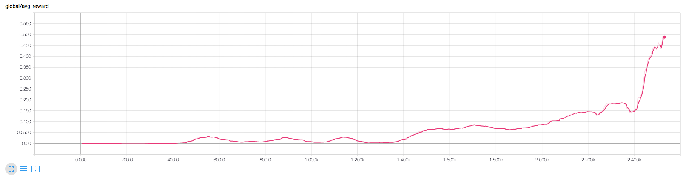

## Learning Algorithm
The algorithm chosen to solve this environment is Multi-Agent Deep Deterministic Policy Gradient (MADDPG).  MADDPG is a multi-agent version of DDPG.  Each agent has it's own actor and it's own critic.  Agents share a common experience replay buffer which contains tuples with states and actions from all agents.  Each agent does it's own sampling from this replay buffer.  This allows agents to learn their own reward function and incorporate the actions of other agents in their learning.  Therefore, we can train them in collaborative, competitive, or mixed environments.  More details can be found in the [MADDPG paper](https://arxiv.org/abs/1706.02275).

For this environment I created two separate DDPG agents.  Each actor takes a 24 dimensional state input.  Each critic takes a concatenation of the states (48 dim) and actions (4 dim) from both agents.

#### Hyperparameters
The chosen hyperparameters closely follow those from the original [DDPG paper](https://arxiv.org/abs/1509.02971).  This includes:
  - Two layer networks, 400 hidden units in the first, 300 in the second, for both actor and critic models.
  - Relu activation for all non linear activation functions.
  - Adam optimizer with learning rates of 1e-4 for the actor and 1e-3 for the critic.
  - Soft target update parameter tau of 1e-3.
  - Discount factor gamma of 0.99.

A few minor changes were made which were found to speed up training:
  - Replay buffer size of 3e5 vs 1e6.
  - Batch size of 128 vs 64.
  - Update gradients every 2 steps vs every step.

#### Key improvements
A couple critical changes were made, without which training was very poor:
  - L2 weight_decay of the critic set to 0.0 (vs 0.01 in the paper).  I think this is because the positive reward signal is pretty sparse in the beginning and this can easily get drowned out by the weight decay.
  - Actions concatenated into the input layer (vs the 1st hidden layer in the paper).  Not sure why this made a difference, I've seen others say it didn't change things much for them.

## Plot of Rewards
Using the supplied hyperparameters the agent is able to solve the environments in 2531 episodes.  See [here](assets/training_output.txt) for detailed training results.

This graph shows the average reward over the last 100 consecutive episodes (after taking the maximum over both agents).

## Ideas for Future Work
  - It would be interesting to apply this algorithm to a more complex environment, like the 2 on 2 [SoccerTwos](https://github.com/Unity-Technologies/ml-agents/blob/master/docs/Learning-Environment-Examples.md#soccer-twos) as this would involve agents working in both a collaborative and competitive manner simultaneously.  Given that each agent is able to learn it's own reward function, this should be feasible.
